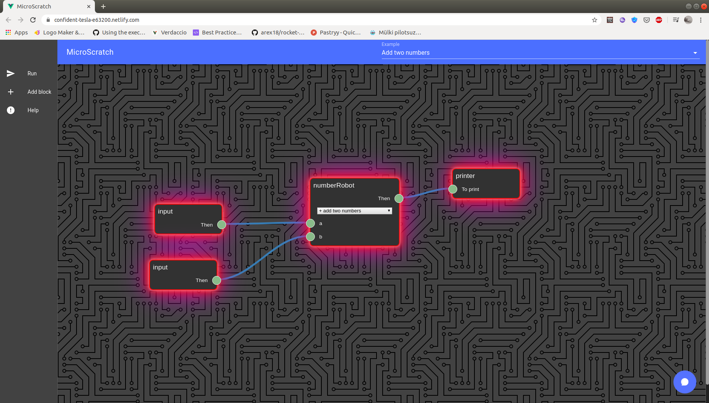
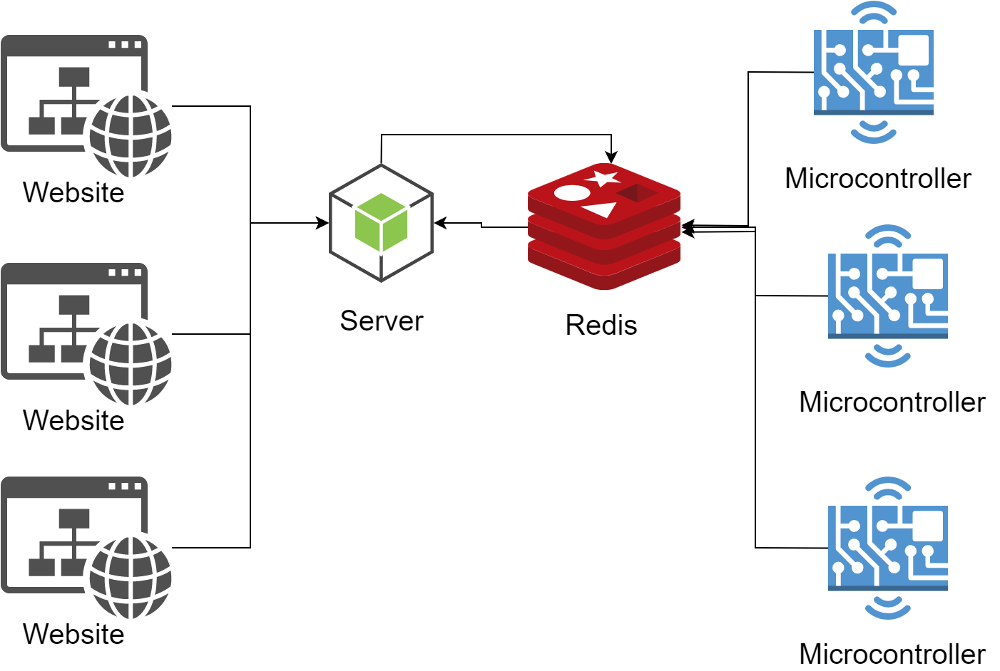

# MicroScratch

The first project is an offshoot of Scratch, a popular graphics program for teaching students programming around the world. This prototype is tied to the use of microcontrollers as a medium for performing all calculations. The type of microcontrollers is not important, however several of the most popular and affordable microcontrollers can be used: Raspberry Pi and Arduino. These microcontrollers have many modules available for them such as a camera, microphone, motors and diodes.

The program interface is experimental and divided into several parts:



1. On the left, we see a menu to launch our program, add a new block and help
2. In the centre, we are working on our program
3. At the bottom right, we see a chat window in which the user “communicates” with the program

This program runs on the microcontroller and the user enters two numbers into the chat and receives the sum of these numbers.
In the future, the following programs and modules can be implemented:
- A program that responds to user requests using a speaker connected to the microcontroller and requests come from chat
- A camera connected to a microcontroller that takes photos when a request comes to chat.
- The smart home system, which is controlled by chat - turn on the light, take a photo, etc.

All of these modules can be added to the program and subsequently programmed. For students, this is a simple interface where they can reveal themselves creatively and understand how programming is applied in the real world.

For students, this is a way to introduce programming with a good example of its usages.

## Architecture
The program consists of 3 parts:
1. A graphical interface in the form of a site that is used to create programs by students.
2. A server that accepts new programs and runs them on microcontrollers
3. An agent installed on the microcontroller to receive a request to launch a new program



The site is written in TypeScript and the VueJS framework. 
At startup, it connects to a server written in NodeJS via WebSockets. Microcontrollers connect to the Redis server and listen for requests for new programs. As soon as a new program is launched from the site, it is sent to a server that publishes it on Redis and from there the microcontroller downloads the program and creates an abstract representation of the program. After that, the microcontroller has a sequential list of instructions and the position of the current instruction, the microcontroller launches the instructions in order and sends the result back to the site so that the user receives answers.


## Other parts

The agent that gets installed on the microcontroller is located here: https://github.com/paladium/MicroScratch-Agent 

## Project setup
```
npm install
npm run serve
npm run build
```

